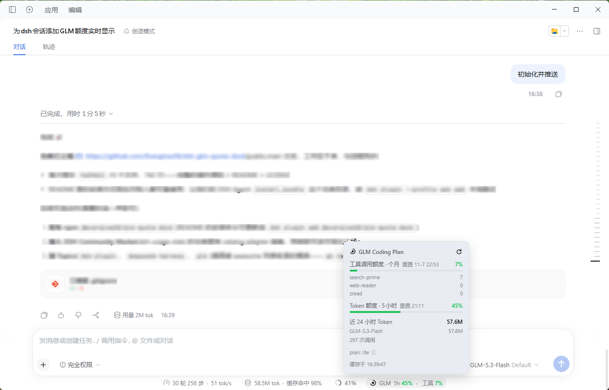
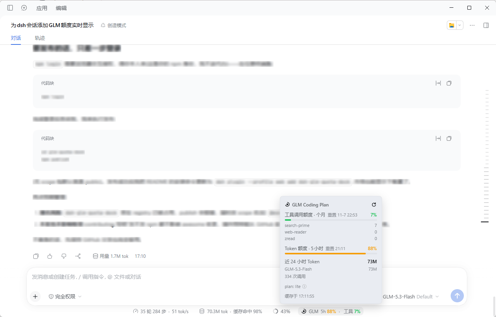
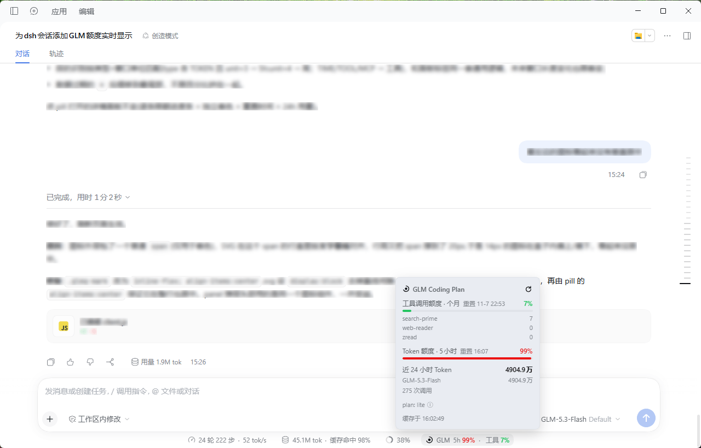

# dsh-glm-quota-dock

[](https://github.com/Everglow28/dsh-glm-quota-dock/releases/latest)
[](https://github.com/Everglow28/dsh-glm-quota-dock/commits/main)
[](LICENSE)

[](https://github.com/Everglow28/dsh-glm-quota-dock/pulls)

[DeepSeek Harness (DSH)](https://github.com/deepseek-ai/deepseek-harness) 插件:在会话输入框下方的统计行内,常驻一个 **GLM Coding Plan 额度 pill**,实时显示各窗口用量百分比。

A lightweight DeepSeek Harness plugin that shows your GLM Coding Plan quota as an always-visible pill in the composer stats row.

```
◔ GLM 5h 9% · 周 45% · 工具 7%
```

## 截图

详情面板(底部统计行内可见 pill),三种额度状态独立着色:

| 正常(<80%,绿) | 告警(≥80%,黄) | 临界(≥95%,红) |
| :---: | :---: | :---: |
|  |  |  |

> 三张图分别为 5 小时窗口 45% / 88% / 99% 的状态: pill 与对应进度条随窗口阈值同步变色;面板含逐条限额、重置时间、近 24 小时按模型用量与套餐档位。

## 特性

- **实时额度**:输入框统计行内常驻 pill,30 秒轮询;每个窗口(5 小时 Token / 周额度 / 工具月度额度)独立着色 —— <80% 绿、≥80% 黄、≥95% 红
- **仅在 GLM 会话显示**:通过会话的模型选择投影判断,只有当前会话走 **Coding Plan 路由** 且使用 `glm-*` 模型时才渲染;纯 API 计费路由(消耗余额而非套餐)不会误亮,非 GLM 会话完全零请求
- **点击详情**:逐条限额进度条(独立着色)、重置时间(悬停看倒计时)、近 24 小时按模型 Token 用量、套餐档位与版本说明、手动强制刷新
- **空闲降频**:页面可见但 5 分钟无操作时自动降为 5 分钟一轮,恢复操作立即刷新;最小化/切走完全停止
- **套餐版本自适应**:V1(5h + 月度)、V2(含周窗口)、新版积分制均按响应字段自动识别展示,未知形状优雅回退
- **密钥不出本机**:API Key 只在 Host 进程内解析与使用,浏览器仅拿到聚合后的百分比;路由挂在 DSH `/api` 信任栅栏与浏览器鉴权之后

## 要求

- DeepSeek Harness(Desktop 或 `dsh web`,建议较新版本)
- 已在 DSH 模型页配置 GLM Coding Plan 供应商(如 `zai-coding-cn`),其 API Key 会通过凭据引用自动解析(默认 `ZAI_CODING_CN_API_KEY`)

> [!NOTE]
> 作者仅在 **Lite 档(历史版本 V1:5 小时窗口 + 月度工具额度)** 上实际验证过。V2(含周窗口)与新版积分制是按官方响应字段做的适配,逻辑上兼容但未经真机验证;如显示异常,欢迎提 issue 附上返回结构。

## 安装

插件零构建、零依赖,直接从 GitHub 仓库安装即可。

**方式 A:让 DSH 会话里的 Agent 安装**(推荐,任何 profile 通用)

把仓库地址交给 DSH 会话里的 Agent:

> 请用 plugin_manager 的 install_bundle 安装 https://github.com/Everglow28/dsh-glm-quota-dock

Agent 会克隆仓库并把 bundle 装进当前 profile,安装成功后按提示**重启 DSH + 刷新网页**即可。

**方式 B:`dsh` CLI + git clone**

```bash
git clone https://github.com/Everglow28/dsh-glm-quota-dock.git
dsh plugin --profile <你的profile> add <克隆目录的绝对路径>
```

**方式 C:手动**

把仓库克隆/复制到 `~/.dsh/profiles/<profile>/node_modules/dsh-glm-quota-dock/`,并在该 profile 的 `cordis.patch.yml` 追加:

```yaml
- insert:
    - id: glm-quota-dock
      name: 'dsh-glm-quota-dock'
      config:
        endpoint: https://open.bigmodel.cn
        minIntervalSec: 60
```

安装后**重启 DSH**(Host 半部需要随进程加载),再**刷新网页**(Client 半部)。

## 配置

在安装时生成的 Cordis entry 的 `config` 下调整(改完重启):

| 字段 | 默认 | 说明 |
| --- | --- | --- |
| `endpoint` | `https://open.bigmodel.cn` | 全球站用户改为 `https://api.z.ai` |
| `minIntervalSec` | `60` | 上游最小请求间隔(秒),下限 30 |
| `apiKeyRef` | `ZAI_CODING_CN_API_KEY` | 凭据引用名(与模型页写入的引用一致) |
| `apiKey` | 无 | 直接内联 key(不推荐,优先用凭据引用) |
| `cwd` | `\` | 上游请求(curl)的工作目录,一般不用改 |

## 工作原理

```
凭据服务解析 API Key(与 zai-coding-cn 模型路由同一把 key)
        │
        ▼
Host 半部调用官方监控端点(裸 key 鉴权,与官方 glm-plan-usage 一致):
  GET {endpoint}/api/monitor/usage/quota/limit     ← 各窗口百分比/重置时间
  GET {endpoint}/api/monitor/usage/model-usage     ← 近 24h 按模型用量
        │  60s 内存缓存 + 并发去重
        ▼
注册认证路由 GET /api/glm-quota(DSH /api 信任栅栏 + 浏览器签名 cookie)
        │
        ▼
Client 半部:同源 fetch,30s 轮询(空闲降频),渲染 pill 与详情面板
```

数据来自智谱官方监控接口(与官方 `glm-plan-usage` 插件同源),轮询频率保守,不触碰任何非公开接口。

## 卸载

```bash
dsh plugin --profile <你的profile> remove "dsh-glm-quota-dock"
```

或让 Agent 调 `plugin_manager remove_bundle`。移除后重启 + 刷新页面。

## 常见问题

- **pill 不显示?** 确认当前会话使用的是 Coding Plan 路由下的 glm 模型;确认凭据引用已配置(面板报错时悬停 "GLM !" 可看原因);Host 半部改动需要重启而非刷新

## License

[MIT](LICENSE)
